<!---
# **Ariel I. Morada Jr.**
Manila, Philippines
[aimoradajr9@gmail.com](mailto:aimoradajr9@gmail.com)
[linkedin.com/in/aimoradajr](https://linkedin.com/in/aimoradajr)
+639271561552
-->

<!-- ABOUT -->
<!-- <h2 class="font-bold text-black-alpha-90">About</h2> -->
<p id="about" class="text-sm font-normal mt-2">
  I am a Software Engineer with <strong>11 years of experience</strong> across various programming technologies and <strong>6 years focused on full-stack Angular and Node.js web development</strong>. I have a particular interest in <strong>UI/UX design</strong>, ensuring that the interfaces I develop are <strong>intuitive and user-friendly</strong>. I am thrilled by the potential of <strong>innovative AI technologies</strong> and enjoy exploring ways to integrate them into modern web solutions.
</p>

<!-- SKILLS -->
<h2 id="skills" class="mt-5 font-bold text-black-alpha-90 text-center sm:text-center md:text-left">Skills</h2>

<div class="grid">
    <div class="mb-1 col-12 sm:mb-3 sm:col-6 md:col-4 md:mb-1 lg:col-4">
		<div class="am-card h-full relative">
			<!-- Tech Logos -->
			<!-- <div class="tech-logos">
				
				
				
				
				
			</div> -->
			<!-- <div class="card-thumbnail">
				
			</div> -->
			<div class="card-content">
				<h3 class="mt-2 mb-3">Full-Stack Web Development</h3>
				<p>Expertise in <strong>Angular</strong>, <strong>TypeScript</strong>, <strong>Node.js</strong>, <strong>ExpressJS</strong>, <strong>NestJS</strong>, <strong>PostgreSQL</strong>, and <strong>Liquibase</strong>.</p>
			</div>
		</div>
	</div>
    <div class="mb-1 col-12 sm:mb-3 sm:col-6 md:col-4 md:mb-1 lg:col-4">
		<div class="am-card h-full bg-white">
			<!-- <div class="card-thumbnail">
				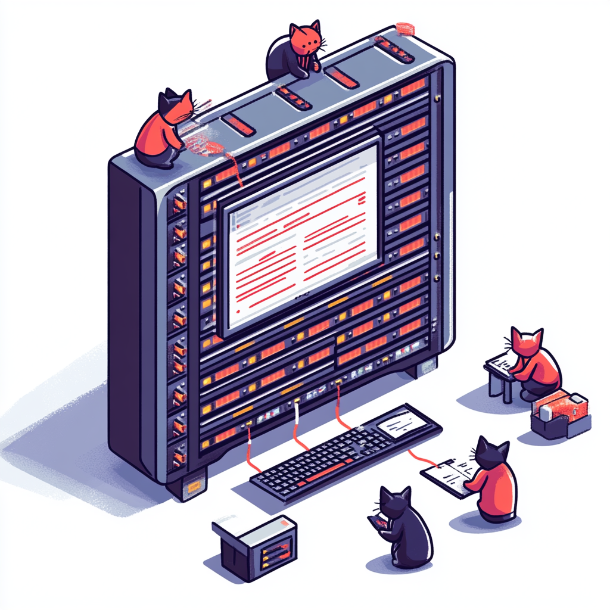
			</div> -->
			<div class="card-content">
				<h3 class="mt-2 mb-3">Backend & Database Management</h3>
				<p>Experience with <strong>Node.js</strong>, <strong>ExpressJS</strong>, <strong>NestJS</strong>, <strong>PHP</strong>, <strong>C</strong>, <strong><span style="white-space: nowrap;">C++</span></strong>, <strong>Perl</strong>, <strong>SQL</strong>, and <strong>OpenAI API</strong>.
				<!-- Skilled in version control using <strong>Git</strong> and platforms like <strong>GitHub</strong> and <strong>Bitbucket</strong>. -->
			</p>
			</div>
		</div>
	</div>
    <div class="mb-1 col-12 sm:mb-3 sm:col-6 md:col-4 md:mb-1 lg:col-4">
		<div class="am-card h-full bg-white">
			<!-- <div class="card-thumbnail">
				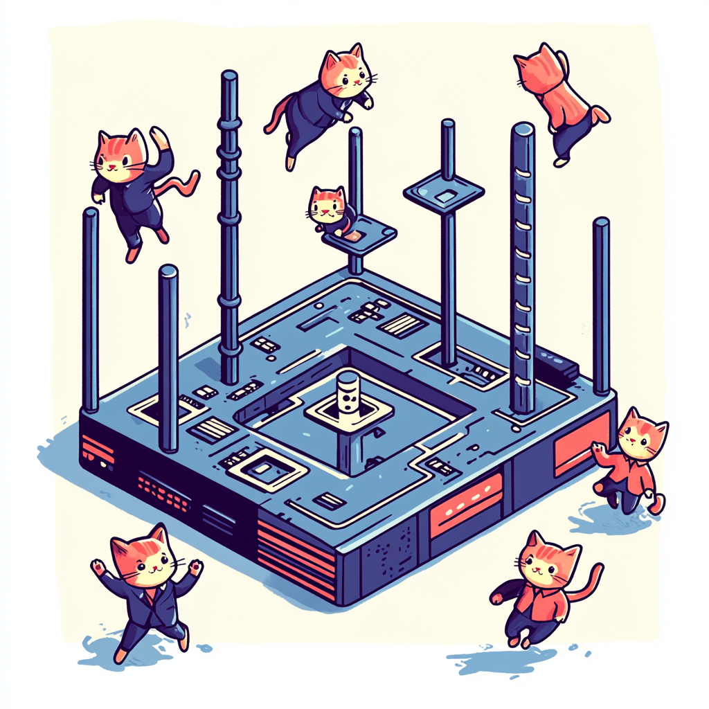
			</div> -->
			<div class="card-content">
				<h3 class="mt-2 mb-3">Agile Development & Project Management</h3>
				<p>Proficient in <strong>Scrum methodology</strong> using tools like <strong>Jira</strong> for project and task management.</p>
			</div>
		</div>
	</div>
    <div class="mb-1 col-12 sm:mb-3 sm:col-6 md:col-4 md:mb-1 lg:col-4">
		<div class="am-card h-full bg-white">
			<!-- <div class="card-thumbnail">
				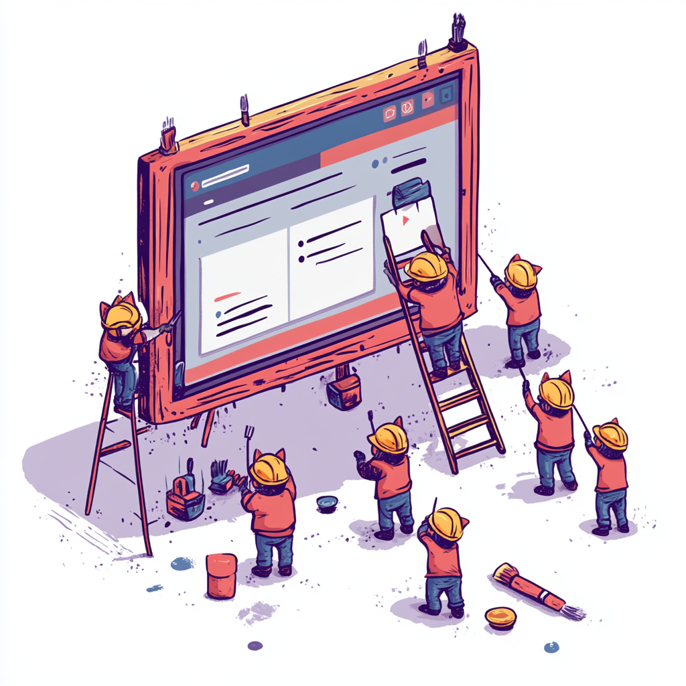
			</div> -->
			<div class="card-content">
				<h3 class="mt-2 mb-3">Frontend Technologies</h3>
				<p>Proficient in <strong>HTML5</strong>, <strong>JavaScript</strong>, <strong>CSS3</strong>, <strong>Bootstrap</strong>, <strong>Semantic UI</strong>, <strong>PrimeNG</strong>, and <strong>Responsive Web Design</strong>.</p>
			</div>
		</div>
	</div>
    <div class="mb-1 col-12 sm:mb-3 sm:col-6 md:col-4 md:mb-1 lg:col-4">
		<div class="am-card h-full bg-white">
			<!-- <div class="card-thumbnail">
				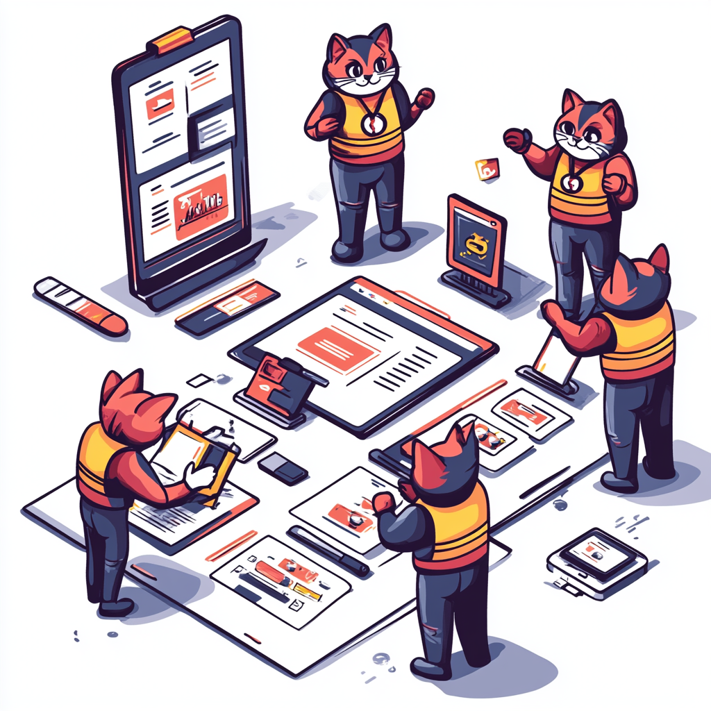
			</div> -->
			<div class="card-content">
				<h3 class="mt-2 mb-3">UI/UX Design</h3>
				<p>Hands-on experience with <strong>Figma</strong>, <strong>Photoshop</strong>, and <strong>Illustrator</strong>, ensuring intuitive and user-friendly design.</p>
			</div>
		</div>
	</div>
    <div class="mb-1 col-12 sm:mb-3 sm:col-6 md:col-4 md:mb-1 lg:col-4">
		<div class="am-card h-full bg-white">
			<!-- <div class="card-thumbnail">
				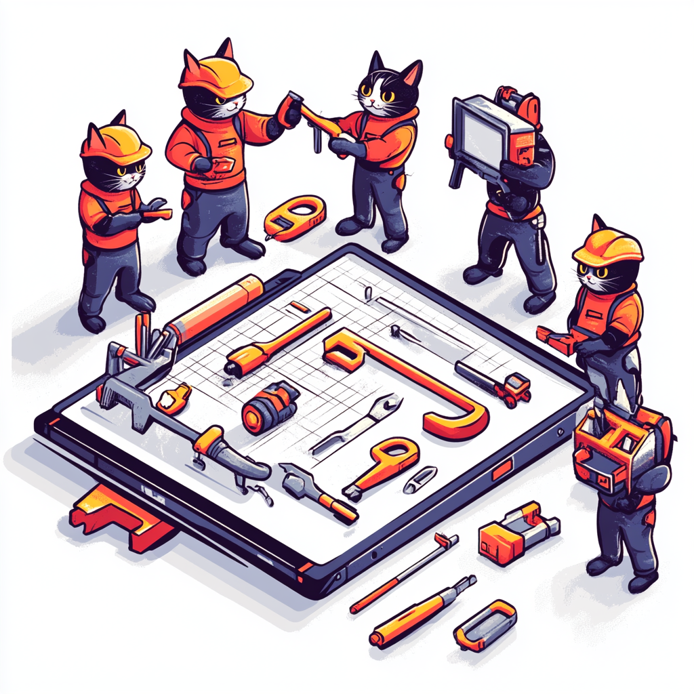
			</div> -->
			<div class="card-content">
				<h3 class="mt-2 mb-3">Miscellaneous</h3>
				<p><strong>WordPress</strong>, <strong>Webflow</strong>, <strong>Ruby on Rails</strong>, <strong>Leaflet</strong>, <strong>Magento</strong>, <strong>AWS</strong>, <strong>Windows Phone</strong>, <strong>SVN</strong>, <strong>ODK</strong>, <strong>Jest</strong>.</p>
			</div>
		</div>
	</div>
	<div class="mb-1 col-12 sm:mb-3 sm:col-6 md:col-4 md:mb-1 lg:col-4">
		<div class="am-card h-full bg-white">
			<div class="card-content">
			<h3 class="mt-2 mb-3">Testing</h3>
			<p>
				Incorporating <strong>Test-Driven Development (TDD)</strong> methodologies, along with testing frameworks such as <strong>Jest</strong>, <strong>Jasmine</strong>, <strong>Karma</strong>.
			</p>
			</div>
		</div>
	</div>
</div>

<!-- PROFESSIONAL EXPERIENCE -->
<h2 id="professional-experience" class="mt-4 font-bold text-black-alpha-90 text-center sm:text-center md:text-left">Professional Experience</h2>

<div class="grid">
	<div class="col-12">
		<div class="am-card w-full bg-white mt-0">
			<div class="card-content">
				<h3>Independent Contractor - Web Developer</h3>
				<strong>Newfields Consulting Oy</strong><br>
				<em>Sep 2021 – Present | Remote, Finland</em><br>
				Developed full-stack web applications using <strong>Angular</strong>, <strong>Node.js</strong>, and <strong>PostgreSQL</strong> for various business solutions.
			</div>
		</div>
	</div>
	<div class="col-12">
		<div class="am-card w-full bg-white mt-0">
			<div class="card-content">
				<h3>Web Developer and Graphic Design</h3>
				<strong>Freelance</strong><br>
				<em>Aug 2018 – Aug 2021 | Dasmariñas, PH</em><br>
				Developed cloud-based apps for academic institutions using <strong>Angular2</strong> and <strong>Node.js</strong>; designed custom logos for branding projects.
			</div>
		</div>
	</div>
	<div class="col-12">
		<div class="am-card w-full bg-white mt-0">
			<div class="card-content">
				<h3>Web Developer</h3>
				<strong>1902 Software Development Corporation</strong><br>
				<em>Nov 2017 – Apr 2018 | Muntinlupa, PH</em><br>
				Built and maintained e-commerce solutions using <strong>Magento</strong>, delivering new features and resolving performance issues for various clients.
			</div>
		</div>
	</div>
	<div class="col-12">
		<div class="am-card w-full bg-white mt-0">
			<div class="card-content">
				<h3>Associate Software Developer</h3>
				<strong>Open iT, Inc.</strong><br>
				<em>May 2013 – Oct 2017 | Lucena, PH</em><br>
				Developed software license management solutions using <strong>C</strong>, <strong>C++</strong>, <strong>Perl</strong>, and modernized legacy systems with <strong>Ruby on Rails</strong> and <strong>AngularJS</strong>.
			</div>
		</div>
	</div>
	<div class="col-12">
		<a href="assets/files/Ariel-I-Morada-Jr-Resume-2024.pdf" target="_blank" class="neo-brutal-button border-round-lg p-3 py-2 w-min p-1 flex align-items-center bg-white hover-email">
			<i class="fas fa-download"></i>
			<span class="ml-2">My_Resume.pdf</span>
		</a>
	</div>
</div>

<!-- PROJECTS -->
<h2 id="projects" class="mt-4 font-bold text-black-alpha-90 text-center sm:text-center md:text-left">Projects</h2>

<div class="grid projects-grid">
  <!-- Project: Openfields June2025-Present -->
  <div class="col-12">
    <div class="am-card w-full bg-white mt-0 flex flex-column sm:flex-row">
      <!-- Thumbnail Section -->
      <div class="card-thumbnail flex-1">
        <div class="project-image-container">
          <a href="assets/images/projects/openfields/openfields.png" class="popup-link">
            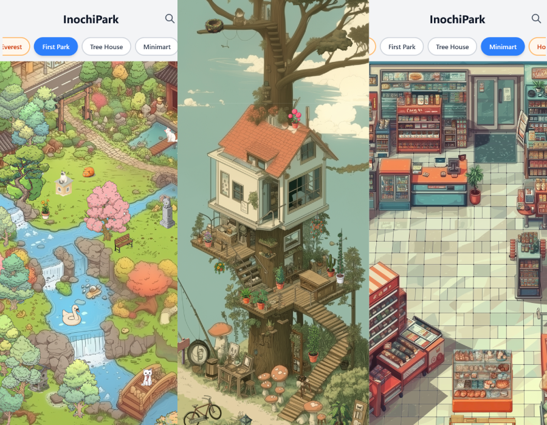
          </a>
        </div>
      </div>
      <!-- Content Section -->
      <div class="card-content flex-1 p-3 flex flex-column">
        <h2 class="mt-2 mb-1">
          <span class="text-sm text-500"></span>OpenFields
          <span class="text-sm text-500">2025</span>
        </h2>
        <p class="text-xs">
		  An interactive pet platform combining AI-generated pet illustrations with artistic themed backgrounds. Users upload pet photos, admins create custom cartoon illustrations using AI, and pets are placed on beautifully crafted scenes like parks and treehouses.
        </p>
        <!-- 
        DETAILED PROJECT DESCRIPTION (HIDDEN - FOR FUTURE POPUP/PAGE):
        
        Project Duration: June 5, 2025 - Present (Ongoing)
        Type: Personal Project
        Role: Full-Stack Developer
        
        Project Overview:
        OpenFields is a digital pet platform that combines artistic scene backgrounds with custom AI-generated pet illustrations. Users upload real pet photos, and admins create personalized cartoon illustrations using AI image generation. These custom pet illustrations are then placed on themed artwork scenes, creating an interactive gallery experience.
        
        Key Features:
        - Artistic themes (City parks, treehouses, minimarts, and more)
        - AI-generated illustrations (Custom cartoon pets created from real photos)
        - Creative customization (Costumes, hats, actions, and more)
        - Photo galleries (Upload up to 5 real pet photos with captions)
        - Interactive viewing (Click pet illustrations to view photo galleries)
        - Responsive design (Mobile and desktop optimized)
        - Admin workflow (Tools for managing submissions and illustrations)
        - Real-time sync (Supabase integration)
        - Animated displays (Interactive pet illustration animations)
        - Role-based access (Admin/public user permissions)
        
        Technologies Used:
        Frontend: Angular 18, TypeScript, Tailwind CSS, SCSS
        Backend: Supabase
        Database: PostgreSQL with Row Level Security (RLS)
        Authentication: Google OAuth, JWT
        AI Image Generation: Midjourney for custom pet illustrations
        Build: Angular CLI, Node.js
        Deployment: Vercel (Frontend), Supabase (Backend)
        
        Architecture:
        - Frontend (Angular) handles all user interaction, pet/photo uploads, and admin tools
        - Communicates directly with Supabase for authentication, data, and storage
        - Supabase provides PostgreSQL database, authentication, and file storage
        - Security enforced using Row Level Security (RLS) and user roles
        - No custom backend code—business logic handled by Supabase policies
        
        Live Demo: https://openfields-seven.vercel.app/mobile
        
        Current Status:
        In active development
        -->
        <div class="pt-3">
          <div class="am-tech-tag">Angular 18</div>
          <div class="am-tech-tag-sub">TypeScript</div>
          <div class="am-tech-tag-sub">Tailwind CSS</div>
          <div class="am-tech-tag-sub">Supabase</div>
          <div class="am-tech-tag-sub">PostgreSQL</div>
          <div class="am-tech-tag-sub">Midjourney AI</div>
        </div>
        <div class="mb-1 mt-2 text-center sm:text-left">
          <a
            href="https://openfields-seven.vercel.app/mobile"
            target="_blank"
            class="neo-brutal-button mt-auto border-round-lg px-2 py-1 w-min bg-white nav-hover-blue white-space-nowrap"
          >
            <span class="mr-2 text-sm">View Project</span>
            <i class="fas fa-external-link-alt"></i>
          </a>
        </div>
      </div>
    </div>
  </div>

  <!-- Project: Apr-May2025 -->
  <div class="col-12">
    <div class="am-card w-full bg-white mt-0 flex flex-column sm:flex-row">
      <!-- Thumbnail Section -->
      <div class="card-thumbnail flex-1">
        <div class="project-image-container">
          <a href="assets/images/projects/pending-thumb4.png" class="popup-link">
            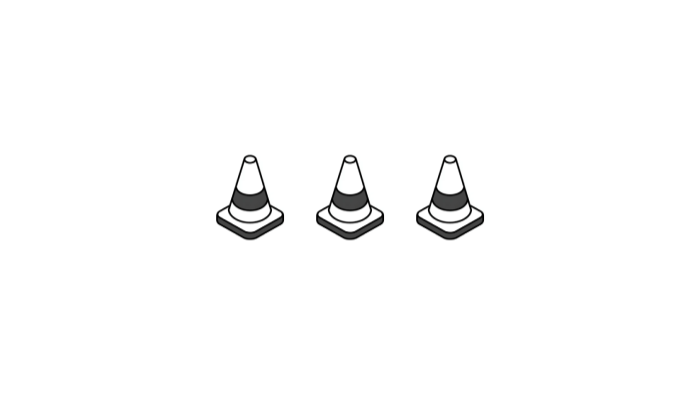
          </a>
        </div>
      </div>
      <!-- Content Section -->
      <div class="card-content flex-1 p-3 flex flex-column">
        <h2 class="mt-2 mb-1">
          <span class="text-sm text-500"></span>Internal Order Management System
          <span class="text-sm text-500">2025</span>
        </h2>
        <p class="text-xs">
		  Contract work for a US-based printing company. Migrated their existing Angular 12 internal order management application to Angular 19, focusing on reimplementing the order processing workflow used by staff to manage t-shirt orders from various channels.
        </p>
        <!-- 
        DETAILED PROJECT DESCRIPTION (HIDDEN - FOR FUTURE POPUP/PAGE):
        
        Project Duration: April 8 - May 20, 2025 (6 weeks)
        Client: District Printing - US-based custom printing company specializing in t-shirts and apparel
        Role: Frontend Developer (Contract)
        
        Project Overview:
        Tasked with upgrading the company's existing Angular 12 internal order management system to Angular 19 (latest version at the time). The application is used by staff members to process orders received via email, messaging apps, and other channels. The primary focus was reimplementing critical frontend components, particularly the order processing workflow, while maintaining integration with their existing Laravel backend infrastructure.
        
        Key Responsibilities:
        - Migrated existing Angular 12 codebase to Angular 19 with latest features and best practices
        - Redesigned and reimplemented the internal order processing form from scratch
        - Created comprehensive order management interface for staff to input t-shirt orders
        - Implemented image upload and management system for customer-provided designs
        - Built delivery date scheduling functionality with calendar integration
        - Integrated with existing Laravel REST APIs and maintained data flow consistency
        - Ensured cross-browser compatibility and optimal performance
        - Collaborated with backend Laravel team to optimize API endpoints
        - Conducted thorough testing and bug fixes throughout development cycle
        
        Main Component Reimplemented - Order Processing Form:
        - Staff interface for inputting customer orders received via email/messaging
        - T-shirt order details management (sizes, colors, quantities, customization options)
        - Customer information and contact details tracking
        - Delivery date selection with availability checking
        - Image upload system for customer-provided designs and artwork
        - Order status tracking and workflow management
        - Real-time pricing calculations based on specifications
        - Form validation and error handling for complex order data
        - Integration with inventory management system
        
        Technical Challenges Solved:
        - Migrated complex form logic from Angular 12 to Angular 19 reactive forms
        - Implemented efficient file upload handling for design images
        - Optimized API call patterns to reduce loading times and improve UX
        - Created reusable form components for consistent order management
        - Handled complex state management for multi-step order process
        
        Technologies Used:
        - Angular 19 (latest features and migration strategies)
        - TypeScript for type-safe development
        - Angular Reactive Forms for complex form handling
        - RxJS for reactive programming and API handling
        - File upload libraries for image management
        - Angular Material/PrimeNG for UI components
        - SCSS for advanced styling and theming
        - Laravel API integration
        - Git version control with feature branch workflow
        
        Results Achieved:
        - Successfully migrated from Angular 12 to Angular 19
        - Delivered modern, responsive order submission system
        - Improved form performance and user experience significantly
        - Reduced code complexity and improved maintainability
        - Enhanced order management workflow efficiency
        - Seamless integration with existing backend systems
        -->
        <div class="pt-3">
          <div class="am-tech-tag">Angular 19</div>
          <div class="am-tech-tag-sub">TypeScript</div>
          <div class="am-tech-tag-sub">Angular Migration</div>
          <div class="am-tech-tag-sub">Laravel API Integration</div>
        </div>
        <!-- <div class="mb-1 mt-2 text-center sm:text-left">
          <a
            href="#"
            target="_blank"
            class="neo-brutal-button mt-auto border-round-lg px-2 py-1 w-min bg-white nav-hover-blue white-space-nowrap"
          >
            <span class="mr-2 text-sm">View Project</span>
            <i class="fas fa-external-link-alt"></i>
          </a>
        </div> -->
      </div>
    </div>
  </div>

  <!-- Project: Mar2025 -->
  <div class="col-12">
    <div class="am-card w-full bg-white mt-0 flex flex-column sm:flex-row">
      <!-- Thumbnail Section -->
      <div class="card-thumbnail flex-1">
        <div class="project-image-container">
          <a href="assets/images/projects/pending-thumb4.png" class="popup-link">
            
          </a>
        </div>
      </div>
      <!-- Content Section -->
      <div class="card-content flex-1 p-3 flex flex-column">
        <h2 class="mt-2 mb-1">
          <span class="text-sm text-500"></span>Project: [Mar2025]
          <span class="text-sm text-500">2025</span>
        </h2>
        <p class="text-xs">
		  Placeholder project description for March 2025.
        </p>
        <div class="pt-3">
          <div class="am-tech-tag">TBD</div>
        </div>
        <!-- <div class="mb-1 mt-2 text-center sm:text-left">
          <a
            href="#"
            target="_blank"
            class="neo-brutal-button mt-auto border-round-lg px-2 py-1 w-min bg-white nav-hover-blue white-space-nowrap"
          >
            <span class="mr-2 text-sm">View Project</span>
            <i class="fas fa-external-link-alt"></i>
          </a>
        </div> -->
      </div>
    </div>
  </div>

  <!-- Project: Feb2025 -->
  <div class="col-12">
    <div class="am-card w-full bg-white mt-0 flex flex-column sm:flex-row">
      <!-- Thumbnail Section -->
      <div class="card-thumbnail flex-1">
        <div class="project-image-container">
          <a href="assets/images/projects/pending-thumb4.png" class="popup-link">
            
          </a>
        </div>
      </div>
      <!-- Content Section -->
      <div class="card-content flex-1 p-3 flex flex-column">
        <h2 class="mt-2 mb-1">
          <span class="text-sm text-500"></span>Project: [Feb2025]
          <span class="text-sm text-500">2025</span>
        </h2>
        <p class="text-xs">
		  Automation. Customer Relationship Management. Marketing Automation. Headless CMS. 
        </p>
        <div class="pt-3">
          <div class="am-tech-tag">Selenium</div>
          <div class="am-tech-tag-sub">n8n</div>
          <div class="am-tech-tag-sub">GoHighLevel</div>
          <div class="am-tech-tag-sub">CallRail</div>
          <div class="am-tech-tag-sub">WhatConverts</div>
          <div class="am-tech-tag-sub">Directus</div>
        </div>
        <!-- <div class="mb-1 mt-2 text-center sm:text-left">
          <a
            href="https://aimoradajr.xyz/kingflute-ph-site/"
            target="_blank"
            class="neo-brutal-button mt-auto border-round-lg px-2 py-1 w-min bg-white nav-hover-blue white-space-nowrap"
          >
            <span class="mr-2 text-sm">View Project</span>
            <i class="fas fa-external-link-alt"></i>
          </a>
        </div> -->
      </div>
    </div>
  </div>
  <!-- Project: Newfields Site -->
  <div class="col-12">
    <div class="am-card w-full bg-white mt-0 flex flex-column sm:flex-row">
      <!-- Thumbnail Section -->
      <div class="card-thumbnail flex-1">
        <div class="project-image-container">
          <a
            href="assets/images/projects/newfields-site/newfields-site.png"
            class="popup-link"
          >
            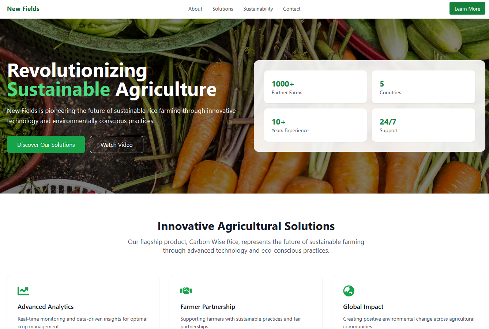
          </a>
        </div>
      </div>
      <!-- Content Section -->
      <div class="card-content flex-1 p-3 flex flex-column">
        <h2 class="mt-2 mb-1">
          <span class="text-sm text-500"></span>Site: Newfields
          <span class="text-sm text-500">2025</span>
        </h2>
        <p class="text-xs">
          Newfields is a company site.
        </p>
        <div class="pt-3">
          <div class="am-tech-tag">Bolt.new</div>
          <div class="am-tech-tag-sub">Netlify</div>
          <div class="am-tech-tag-sub">React</div>
        </div>
        <div class="mb-1 mt-2 text-center sm:text-left">
        </div>
      </div>
    </div>
  </div>
  <!-- Project: House Ino PH Site -->
  <div class="col-12">
    <div class="am-card w-full bg-white mt-0 flex flex-column sm:flex-row">
      <!-- Thumbnail Section -->
      <div class="card-thumbnail flex-1">
        <div class="project-image-container">
          <a
            href="assets/images/projects/house-ino/house-ino-site.png"
            class="popup-link"
          >
            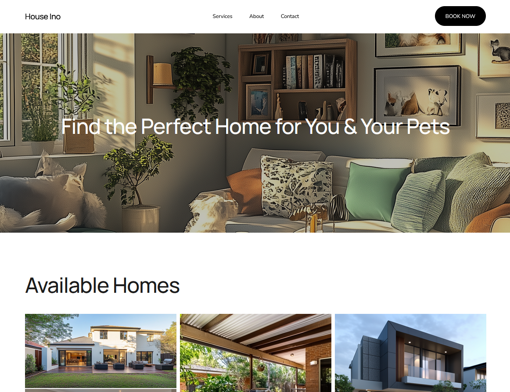
          </a>
        </div>
      </div>
      <!-- Content Section -->
      <div class="card-content flex-1 p-3 flex flex-column">
        <h2 class="mt-2 mb-1">
          <span class="text-sm text-500"></span>Site: House Ino
          <span class="text-sm text-500">2025</span>
        </h2>
        <p class="text-xs">
          House Ino is a personal project developed to enhance my web development skills, featuring a Squarespace-based platform that connects families with pet-friendly homes.
        </p>
        <div class="pt-3">
          <div class="am-tech-tag">Squarespace v7.1</div>
          <div class="am-tech-tag-sub">Midjourney/Dall-E</div>
        </div>
        <div class="mb-1 mt-2 text-center sm:text-left">
        </div>
      </div>
    </div>
  </div>

  <!-- Mini Project: SEO Optimization. French Productions -->

  <!-- Project: Jan2025 -->
  <div class="col-12">
    <div class="am-card w-full bg-white mt-0 flex flex-column sm:flex-row">
      <!-- Thumbnail Section -->
      <div class="card-thumbnail flex-1">
        <div class="project-image-container">
          <a href="assets/images/projects/pending-thumb4.png" class="popup-link">
            
          </a>
        </div>
      </div>
      <!-- Content Section -->
      <div class="card-content flex-1 p-3 flex flex-column">
        <h2 class="mt-2 mb-1">
          <span class="text-sm text-500"></span>Project: [Jan2025]
          <span class="text-sm text-500">2025</span>
        </h2>
        <p class="text-xs">
		  Automation. Customer Relationship Management. Field Service Management. Marketing Automation. Headless CMS. 
        </p>
        <div class="pt-3">
          <div class="am-tech-tag-sub">n8n</div>
          <div class="am-tech-tag-sub">GoHighLevel</div>
          <div class="am-tech-tag-sub">FieldRoutes</div>
          <div class="am-tech-tag-sub">Directus</div>
          <div class="am-tech-tag-sub">Sendspark</div>
          <div class="am-tech-tag-sub">Trello</div>
        </div>
        <!-- <div class="mb-1 mt-2 text-center sm:text-left">
          <a
            href="https://aimoradajr.xyz/kingflute-ph-site/"
            target="_blank"
            class="neo-brutal-button mt-auto border-round-lg px-2 py-1 w-min bg-white nav-hover-blue white-space-nowrap"
          >
            <span class="mr-2 text-sm">View Project</span>
            <i class="fas fa-external-link-alt"></i>
          </a>
        </div> -->
      </div>
    </div>
  </div>
  <!-- Project: Kingflute PH Site -->
  <div class="col-12">
    <div class="am-card w-full bg-white mt-0 flex flex-column sm:flex-row">
      <!-- Thumbnail Section -->
      <div class="card-thumbnail flex-1">
        <div class="project-image-container">
          <a
            href="assets/images/projects/kingflute-ph-site.png"
            class="popup-link"
          >
            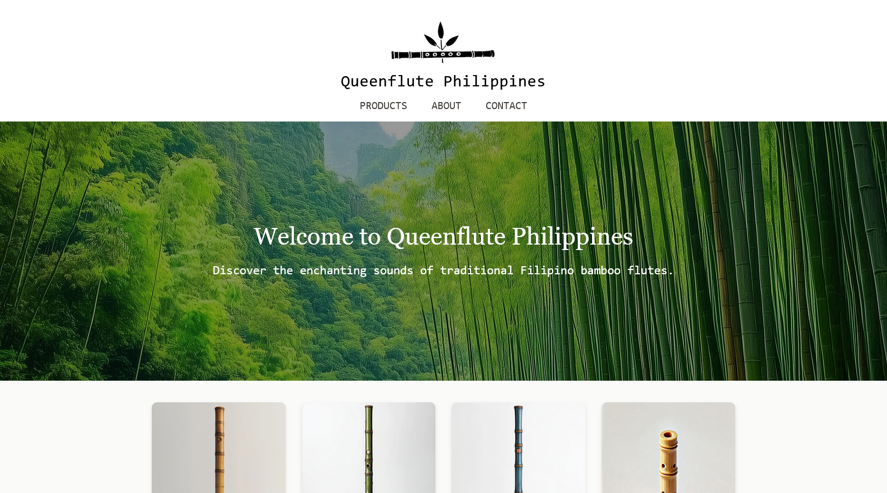
          </a>
        </div>
      </div>
      <!-- Content Section -->
      <div class="card-content flex-1 p-3 flex flex-column">
        <h2 class="mt-2 mb-1">
          <span class="text-sm text-500"></span>Site: Queenflute PH
          <span class="text-sm text-500">2025</span>
        </h2>
        <p class="text-xs">
          A personal project website featuring handcrafted bamboo flutes,
          blending traditional Filipino craftsmanship with modern design.
        </p>
        <div class="pt-3">
          <div
            class="am-tech-tag"
            style="color: #61dafb; border-color: #61dafb"
          >
            React
          </div>
          <div class="am-tech-tag">TailwindCSS</div>
          <div class="am-tech-tag-sub">Tailwind Scrollbar</div>
          <div class="am-tech-tag-sub">Stackblitz</div>
          <div class="am-tech-tag-sub">Github Pages</div>
          <div class="am-tech-tag-sub">Midjourney/Dall-E</div>
        </div>
        <div class="mb-1 mt-2 text-center sm:text-left">
          <a
            href="https://aimoradajr.xyz/kingflute-ph-site/"
            target="_blank"
            class="neo-brutal-button mt-auto border-round-lg px-2 py-1 w-min bg-white nav-hover-blue white-space-nowrap"
          >
            <span class="mr-2 text-sm">View Project</span>
            <i class="fas fa-external-link-alt"></i>
          </a>
        </div>
      </div>
    </div>
  </div>
  <!-- Project: Agent Ino -->
  <div class="col-12">
    <div class="am-card w-full bg-white mt-0 flex flex-column sm:flex-row">
      <!-- Thumbnail Section -->
      <div class="card-thumbnail flex-1">
        <div class="project-image-container">
          <a
            href="assets/images/projects/agent-ino-thumb.png"
            class="popup-link"
          >
            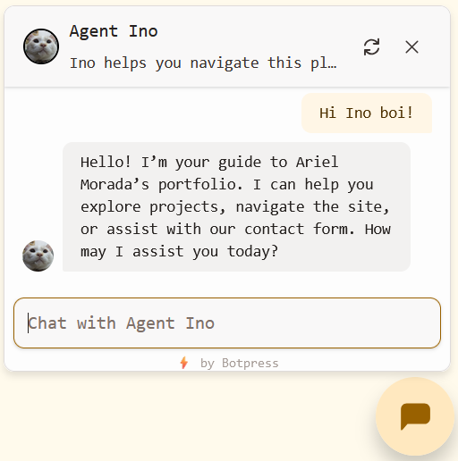
          </a>
        </div>
      </div>
      <!-- Content Section -->
      <div class="card-content flex-1 p-3 flex flex-column">
        <h2 class="mt-2 mb-1">
          <span class="text-sm text-500"></span>Agent Ino
          <span class="text-sm text-500">2025</span>
        </h2>
        <p class="text-xs">
          A personalized AI assistant integrated into my portfolio website,
          designed to engage visitors, answer queries, and showcase my skills
          and projects interactively.
        </p>
        <div class="pt-3">
          <div class="am-tech-tag">Botpress</div>
        </div>
        <!-- <div class="mb-1 mt-2 text-center sm:text-left">
					<a href="https://aimoradajr.xyz/ph-vote-map/" target="_blank" class="neo-brutal-button mt-auto border-round-lg px-2 py-1 w-min bg-white nav-hover-blue white-space-nowrap">
					<span class="mr-2 text-sm">View Project</span>
					<i class="fas fa-external-link-alt"></i>
					</a>
				</div> -->
      </div>
    </div>
  </div>
  <!-- Project: PH Metro -->
  <div class="col-12">
    <div class="am-card w-full bg-white mt-0 flex flex-column sm:flex-row">
      <!-- Thumbnail Section -->
      <div class="card-thumbnail flex-1">
        <div class="project-image-container">
          <a
            href="assets/images/projects/ph-metro-thumb.png"
            class="popup-link"
          >
            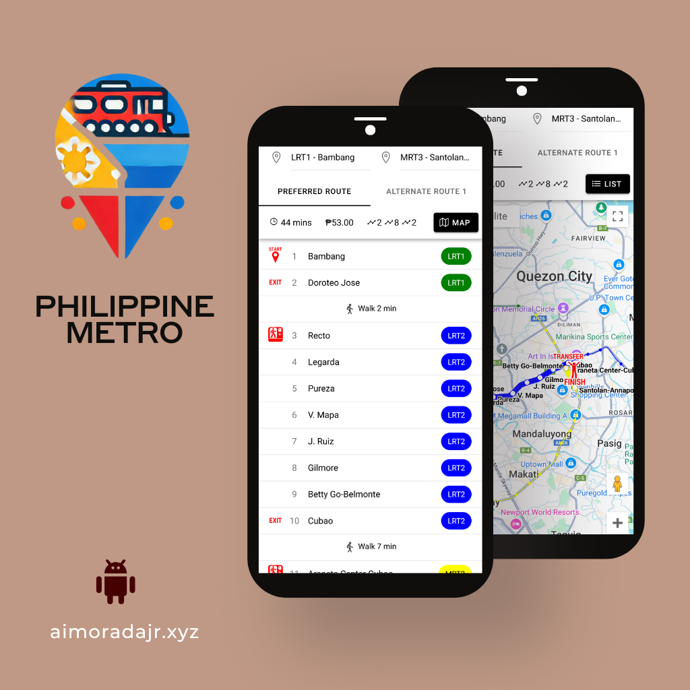
          </a>
        </div>
      </div>
      <!-- Content Section -->
      <div class="card-content flex-1 p-3 flex flex-column">
        <h2 class="mt-2 mb-1">
          <span class="text-sm text-500">[Testing] </span>Philippine Metro
          <span class="text-sm text-500">2025</span>
        </h2>
        <p class="text-xs">
          A mobile app to navigate Manila's MRT and LRT with station guides,
          routes, and stops.
        </p>
        <div class="pt-3">
          <div class="am-tech-tag">Angular v18</div>
          <div
            class="am-tech-tag"
            style="color: #3880ff; border-color: #3880ff"
          >
            Ionic Framework v8
          </div>
          <div
            class="am-tech-tag"
            style="color: #3880ff; border-color: #3880ff"
          >
            Capacitor v6
          </div>
          <div
            class="am-tech-tag"
            style="color: #3ddc84; border-color: #3ddc84"
          >
            Android
          </div>
          <div class="am-tech-tag-sub">TypeScript</div>
          <div class="am-tech-tag-sub">Midjourney/ChatGPT (Images)</div>
          <div
            class="am-tech-tag"
            style="color: #ff3a3a; border-color: #ff3a3a"
          >
            Google Maps JavaScript API
          </div>
        </div>
        <!-- <div class="mb-1 mt-2 text-center sm:text-left">
					<a href="https://aimoradajr.xyz/ph-vote-map/" target="_blank" class="neo-brutal-button mt-auto border-round-lg px-2 py-1 w-min bg-white nav-hover-blue white-space-nowrap">
					<span class="mr-2 text-sm">View Project</span>
					<i class="fas fa-external-link-alt"></i>
					</a>
				</div> -->
      </div>
    </div>
  </div>
  <!-- Project: Directus 'AI Field' extension -->
  <div class="col-12">
    <div class="am-card w-full bg-white mt-0 flex flex-column sm:flex-row">
      <!-- Thumbnail Section -->
      <div class="card-thumbnail flex-1">
        <div class="project-image-container">
          <a
            href="assets/images/projects/directus-ai-field.gif"
            class="popup-link"
          >
            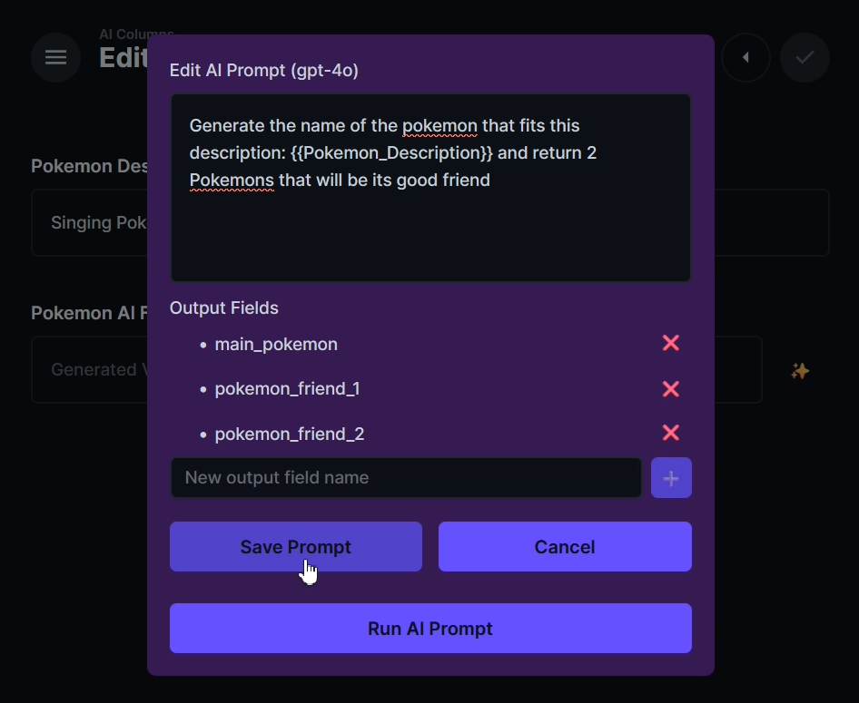
          </a>
        </div>
      </div>
      <!-- Content Section -->
      <div class="card-content flex-1 p-3 flex flex-column">
        <h2 class="mt-2 mb-1">
          Directus 'AI Field' extension
          <span class="text-sm text-500">2024</span>
        </h2>
        <p class="text-xs">
          A Directus extension that enables users to configure prompts for
          automatic content generation via OpenAI
        </p>
        <div class="pt-3">
          <div class="am-tech-tag">Directus v11.2.2</div>
          <div
            class="am-tech-tag"
            style="color: #42b883; border-color: #42b883"
          >
            Vue.js v3.4
          </div>
          <div class="am-tech-tag">TypeScript</div>
          <div class="am-tech-tag" style="color: purple; border-color: purple">
            OpenAI GPT-4.0
          </div>
          <!-- <div class="am-tech-tag-sub">PostgreSQL v8.13.1</div> -->
        </div>
        <!-- <div class="mb-1 mt-2 text-center sm:text-left">
					<a href="https://aimoradajr.xyz/ph-vote-map/" target="_blank" class="neo-brutal-button mt-auto border-round-lg px-2 py-1 w-min bg-white nav-hover-blue white-space-nowrap">
					<span class="mr-2 text-sm">View Project</span>
					<i class="fas fa-external-link-alt"></i>
					</a>
				</div> -->
      </div>
    </div>
  </div>
  <!-- Project: PH Vote Map -->
  <div class="col-12">
    <div class="am-card w-full bg-white mt-0 flex flex-column sm:flex-row">
      <!-- Thumbnail Section -->
      <div class="card-thumbnail flex-1">
        <div class="project-image-container">
          <a href="assets/images/projects/ph_vote_map.gif" class="popup-link">
            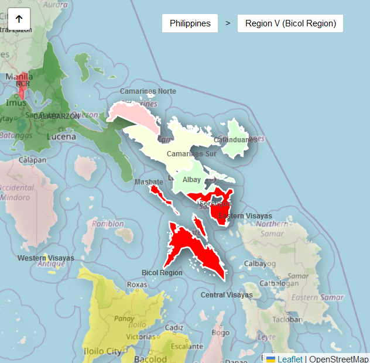
          </a>
        </div>
      </div>
      <!-- Content Section -->
      <div class="card-content flex-1 p-3 flex flex-column">
        <h2 class="mt-2 mb-1">
          PH Vote Map <span class="text-sm text-500">2024</span>
        </h2>
        <p class="text-xs">
          An interactive visualization tool that displays election results
          across the Philippines, highlighting leading and confirmed winners in
          each region.
        </p>
        <div class="pt-3">
          <div class="am-tech-tag">Angular v18.1.0</div>
          <div
            class="am-tech-tag"
            style="color: #199900; border-color: #199900"
          >
            Leaflet v1.9.4
          </div>
          <div class="am-tech-tag">faeldon/philippines-json-maps</div>
          <div class="am-tech-tag-sub">Font Awesome v6.0.0</div>
          <div class="am-tech-tag-sub">Stackblitz</div>
          <div class="am-tech-tag-sub">Github Pages</div>
        </div>
        <div class="mb-1 mt-2 text-center sm:text-left">
          <a
            href="https://aimoradajr.xyz/ph-vote-map/"
            target="_blank"
            class="neo-brutal-button mt-auto border-round-lg px-2 py-1 w-min bg-white nav-hover-blue white-space-nowrap"
          >
            <span class="mr-2 text-sm">View Project</span>
            <i class="fas fa-external-link-alt"></i>
          </a>
        </div>
      </div>
    </div>
  </div>
  <!-- Project: AI Class Scheduling -->
  <div class="col-12">
    <div class="am-card w-full bg-white mt-0 flex flex-column sm:flex-row">
      <!-- Thumbnail Section -->
      <div class="card-thumbnail flex-1">
        <div class="project-image-container">
          <a href="assets/images/projects/ai_scheduling.gif" class="popup-link">
            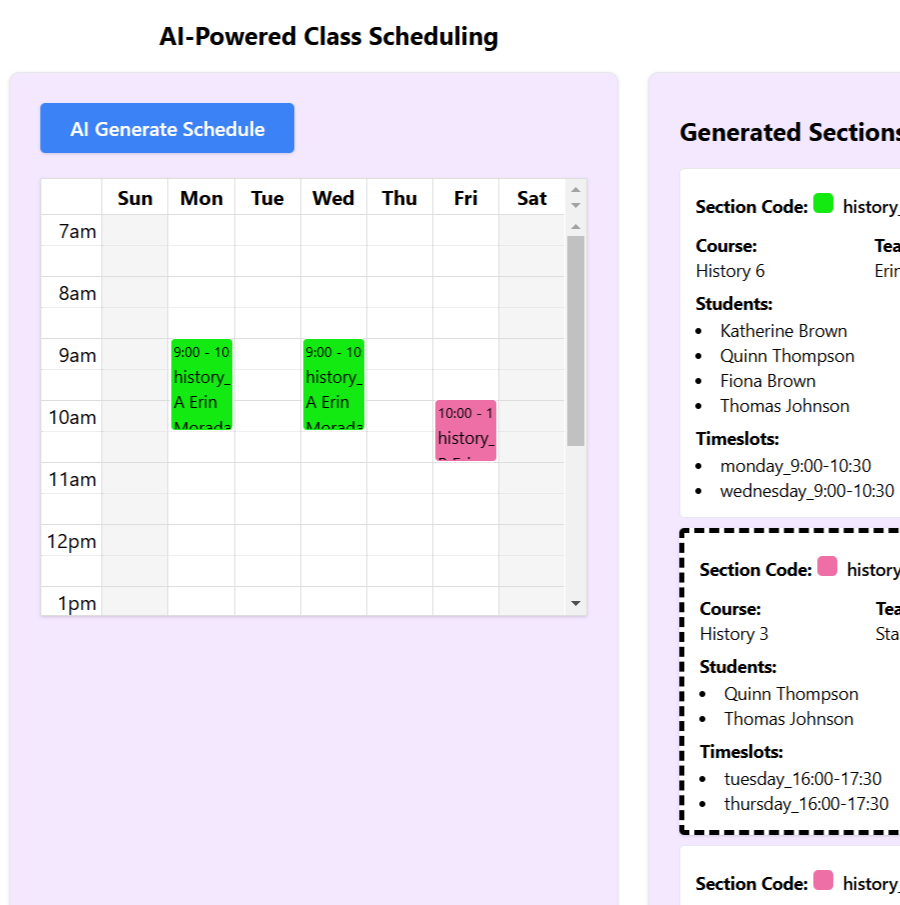
          </a>
        </div>
      </div>
      <!-- Content Section -->
      <div class="card-content flex-1 p-3 flex flex-column">
        <h2 class="mt-2 mb-1" title="AI-Powered Class Scheduling">
          AI Class Scheduling <span class="text-sm text-500">2024</span>
        </h2>
        <p class="text-xs">
          AI-Powered Class Scheduling uses OpenAI's AI model
          (<strong>gpt-4o</strong>) to analyze data, resolve conflicts, and
          optimize schedules for courses, rooms, teachers, and students.
        </p>
        <div class="pt-3">
          <!-- Backend Technologies -->
          <div class="am-tech-tag">Node.js v20.x</div>
          <div class="am-tech-tag">Express.js v4.21.1</div>
          <div class="am-tech-tag" style="color: purple; border-color: purple">
            OpenAI GPT-4.0
          </div>
          <div class="am-tech-tag">AWS Lambda</div>
          <div class="am-tech-tag" title="Serverless Framework">Serverless</div>
          <!-- divider -->
          <div
            class="border-top-2 mx-3 mt-1 mb-2 border-gray-400 hidden sm:block"
          ></div>
          <!-- Frontend Technologies -->
          <div class="am-tech-tag">Angular v18.1.0</div>
          <div class="am-tech-tag">Tailwind CSS</div>
          <div class="am-tech-tag">FullCalendar v6.1.15</div>
          <div class="am-tech-tag-sub">Stackblitz</div>
        </div>
        <div class="mb-1 mt-2 text-center sm:text-left">
          <a
            href="https://stackblitz.com/edit/stackblitz-starters-6tidvq?file=src%2Fmain.html"
            target="_blank"
            class="neo-brutal-button mt-auto border-round-lg px-2 py-1 w-min bg-white nav-hover-blue white-space-nowrap"
          >
            <span class="mr-2 text-sm">View Project</span>
            <i class="fas fa-external-link-alt"></i>
          </a>
        </div>
      </div>
    </div>
  </div>
</div>

<!-- EDUCATION -->
<!-- <h2 class="font-bold text-black-alpha-90 text-center sm:text-center md:text-left">Education</h2>

<div>
**Bachelor of Science in Computer Science (BSCS)**
*University of the Philippines Los Baños (UPLB)*
*2009 – 2013*
</div>
-->

<!-- ME -->
<h2
  id="me"
  class="font-bold text-black-alpha-90 mt-8 sm:mt-8 md:mt-5 text-center sm:text-center md:text-left"
>
  Me
</h2>

<div class="text-center sm:text-center md:text-left">
  
</div>

<p class="text-base font-normal mt-1 text-center sm:text-center md:text-left">
  This is me, circa 2024.
</p>

<!-- NOTES -->
<p
  class="text-xs font-normal text-700 text-center sm:text-center md:text-left"
  style="margin-top: 10rem"
>
  Started with the Jekyll Minimal theme, customized it to fit a
  Neo-Brutalist-inspired style. Used PrimeFlex for layout structure and styling,
  incorporated Midjourney-generated images for a unique visual touch, and hosted
  it all through GitHub Pages.
</p>

<script>
  $(document).ready(function () {
    $(".popup-link").magnificPopup({
      type: "image",
      gallery: {
        enabled: true, // Set to true to enable gallery mode
      },
    });
  });
</script>

```

```

```

```
